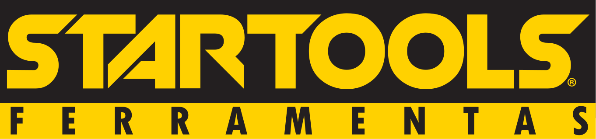

<div align="center">
  
</div>

<h1 align="center">Startools ExpoScan 🚀</h1>

<p align="center">
  <strong>Uma aplicação web responsiva (Mobile-First) projetada para feiras e eventos, permitindo o escaneamento rápido e pesquisa de produtos via código de barras GTIN13.</strong>
</p>

<p align="center">
  
  
  
  
</p>

---

## 📋 Sobre o Projeto

O **Startools ExpoScan** foi idealizado para modernizar a experiência em stands de feiras e eventos da Startools. A solução elimina a dependência exclusiva do atendimento tradicional, oferecendo aos visitantes a autonomia de buscar informações detalhadas do catálogo através dos seus próprios smartphones ou em tablets disponibilizados no evento.

Inspirado na usabilidade minimalista (estilo Google Search) e fundamentado na robusta paleta industrial (`#FFD100` e fundos escuros), a aplicação fornece um **UX fluido e direto**. 

## ✨ Principais Funcionalidades

- **🔍 Pesquisa Autocomplete:** Sistema de busca em tempo real. Digite 3 letras ou os números do código GTIN13 para sugestões dinâmicas de produtos.
- **📷 Leitura de Código de Barras Escaneado (Scanner):** Integração `WebRTC` através do `@zxing/library` para abrir a câmera traseira do dispositivo e capturar rapidamente códigos de barra GTIN13.
- **📱 Interface Mobile-First Dinâmica:** O sistema avalia os dados recebidos. Falta de mídia ou vídeo? O Layout reage de forma autônoma e oculta as seções em branco sem perdas visuais.
- **⚡ Alta Performance Edge:** Arquitetura single-page que lida com renderizações otimizadas visando também conexões de feiras possivelmente instáveis.

## 🛠 Arquitetura e Tecnologia Utilizada

Para garantir escalabilidade e velocidade, decidi utilizar as seguintes stacks:

- **React 18 + Vite:** Fast Refresh imediato, build toolchain extremamente leve e ágil.
- **TypeScript:**  Garante tipagem sólida para o preenchimento de mídias (Vídeos, imagens principais).
- **Vanilla CSS (System Variables):** Utilização pura de variáveis globais baseadas no pantone 129C industrial para obter exatamente o *feeling* premium e responsivo sem inchar o projeto com libs pesadas.
- **ZXing for JS:** Biblioteca open-source altamente robusta de parse e decoding de barras via processamento do cliente, aliviando back-end de transferências em imagens blob pesadas.

## 🚀 Como Executar Localmente

Siga o passo a passo caso deseje rodar a infraestrutura local do MVP.

1. Clone o repositório ou faça o download da pasta.
```bash
git clone https://github.com/SeuUsuario/startools-exposcan.git
```
2. Instale as dependências:
```bash
npm install
```
3. Rode o servidor de desenvolvimento:
```bash
npm run dev
```

> **Dica:** Para testar a API Mock local, você pode pesquisar por `Politriz` ou o código `7891234567890`.

## 🎨 Design System Adotado

A direção de arte baseia-se num espectro escuro para trazer o amarelo como ponto de ação extrema:

- **Primária (Ação/Botões):** `#FFD100` (Pantone 129C Equivalente Digital)
- **Fundo / Background Principal:** `#111111`
- **Cards e Superfícies:** `#2B2B2B`
- **Font-family:** `Inter`, desenhada especificamente focado em leitura legível nas interfaces em telas menores.

<p align="center">
  ---
  Desenvolvido visando alta conversão de feiras e autonomia tecnológica.
</p>
